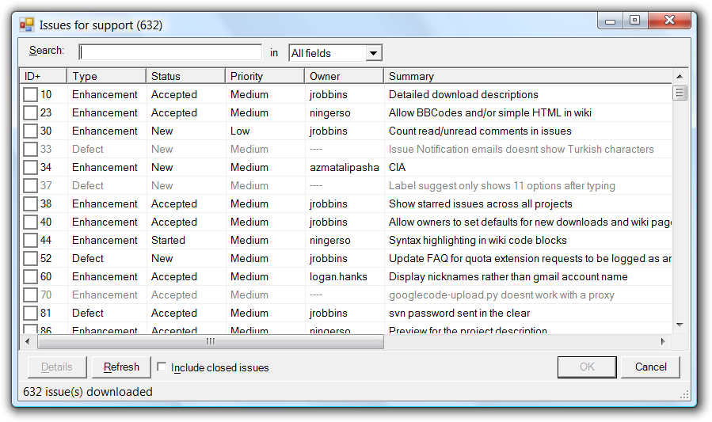

# Gurtle: Google Code project issue tracker integration for TortoiseSVN & TortoiseGit

:warning: **This project has been archived and is no longer maintained
since [Google bid farewell to Google Code][bye-gc].** It is hosted here on
GitHub nonetheless just to capture some of the assets (like issues) for the
purpose of historical record. The [original Subversion code repository has been 
archived on Assembla.][svnrepo] 

## Introduction

Gurtle is a [TortoiseSVN][tsvn]/[TortoiseGit][tgit] issue tracker plug-in (an 
[IBugTraqProvider][ibugtraqprovider] implementation) for [projects hosted at 
Google Code][gc].

With release 1.5, TortoiseSVN (and TortoiseGit later) introduced the 
possibility for anyone to author a COM-based plug-in that enables a user to 
query a project's issue tracking system during a commit. Gurtle is such a 
plug-in and enables the user to consult issues of a project hosted by Google 
Code from within the [TortoiseSVN Commit dialog box][tsvn-commit]. The 
screenshot below shows how the issue dialog box looks like in Gurtle for the 
[project hosting support][gc-support] project.

When you select one or more issues, Gurtle appends the number and summary of 
each issue to the commit log message.

## Feature Overview ##

Gurtle's issue browsing dialog box sports the following notable features:

* Download of issues in the background
* Sort issues by clicking on column headers
* Conduct free-text and interactive search along one or across all dispalyed 
  columns
* Search issues as download happens in the background
* See closed in addition to open issues
* Unowned/Unassigned issues appear visually distinct (dimmed)
* Closed issues appear visually distinct (struck-out)
* Open detail page of an issue in the default Web browser
* Notification of version updates

## Requirements ##

* [TortoiseSVN](http://tortoisesvn.net/downloads) or [TortoiseGit][tgit]
* [Microsoft .NET Framework 2.0][dotnet20]
* Any Windows version where TortoiseSVN and Microsoft .NET Framework 2.0 are 
  supported though most testing has been conducted on Windows XP and Vista.
* Internet connection for reaching [Google Code][gc]
* [More details][more-reqs]

  [tsvn]: http://tortoisesvn.net/
  [tgit]: http://tortoisegit.org/
  [ibugtraqprovider]: http://tortoisesvn.net/docs/release/TortoiseSVN_en/tsvn-ibugtraqprovider.html
  [gc]: http://code.google.com/hosting
  [tsvn-commit]: http://tortoisesvn.net/docs/release/TortoiseSVN_en/tsvn-dug-commit.html#tsvn-dug-commit-basics
  [gc-support]: http://code.google.com/p/support/
  [bye-gc]: http://google-opensource.blogspot.co.uk/2015/03/farewell-to-google-code.html
  [svnrepo]: https://www.assembla.com/spaces/gurtle/subversion/source
  [dotnet20]: http://www.microsoft.com/downloads/details.aspx?FamilyID=0856EACB-4362-4B0D-8EDD-AAB15C5E04F5
  [more-reqs]: https://github.com/atifaziz/gurtle/blob/wiki/Requirements.md
